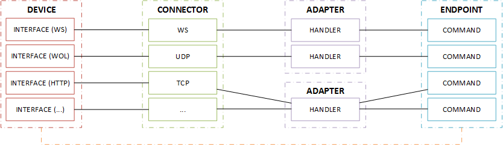

# Documentation
**For Developer.**\
Example Database dump can be found [here](./assets/database.gz).

## Architecture
1) Overview
2) Adapter
3) Connector
4) Endpoints

### 1) Overview


### 2) Adapter
Adapter implements a protocol specification for comunication with a devicee/interface.\
Example: eISCP/ISCP for Pioneer/Onkyo AV Receivers.

### 3) Connector
A Connector is responsible for the communication between a adapter and a interface.\
Its like a proxy for two parties, it must allways run on the local network.\
The data forwarding to the backend/api is realized over websockets.

[Read more](./Connector.md)

### 4) Endpoints
A Endpoint is a controllable thing. This "thing" exists may be not physical.\
The Endpoint is connected with/over a interface/connector to a adapter.\


## REST API
[Documentation](./rest-api.md)

### Global

OpenHaus use various models/schemas:
- adapters
- devices
- endpoints
- rooms
- scenes

### HTTP methods
`GET` Fetch a resource (list)\
`POST` Update a resource\
`PUT` Create new resource\
`DELETE` Remove a resource

All requests must have set the "Content-Type" header to `application/json`

### Example

#### Fetch a resource
> `GET` /api/\<model>\
> `GET` https://cloud.open-haus.io/api/adapters/507f191e810c19729de860ea

#### Response
```json
{
    "_id": "507f191e810c19729de860ea",
    "description": "OpenHaus - RAW Adapter",
    "version": 1.0,
    "author": "Marc Stirner <marc.stirner@open-haus.io>",
    "folder": "oh.generic.raw"
}
```

#### Create a new resource
`PUT https://cloud.open-haus.io/api/devices/`
```json
{
    "name": "LED Controller (SPI)",
    "icon": "fa-raspberry-pi",
    "interfaces": [{
        "type": "ETHERNET",
        "description": "FX selection api",
        "settings": {
        	"host": "192.168.2.108",
           	"port": 80,
           	"protocol": "ws"
        }
	},{
        "type": "ETHERNET",
        "description": "RAW SPI Buffer\nEverything thats get sendet here, is writen on the spi bus!",
        "settings": {
        	"host": "192.168.2.108",
           	"port": 8080,
           	"protocol": "ws"
        }
	}]
}
```

The example above creates two interfaces:
- FX selection API
- RAW SPI Buffer

Both are IP/ETHERNET, but they have diffrent purposes.\
One is to select a Effect for the attached LED strip.\
The other one is to write directly to the LED strip.

Both interfaces can be reached direct over a WebSocket conenction without a adapter intercept our communication.\
Assumed the device is added successful (no validation error occoured) and has the ObectId `517f195e810c19729de760fa`,\
we are able to connect via vanilla WebSocket to the interface:

`<host>/api/devices/517f195e810c19729de760fa/interfaces/<iface id>`
(Each interface gets it own unique id)